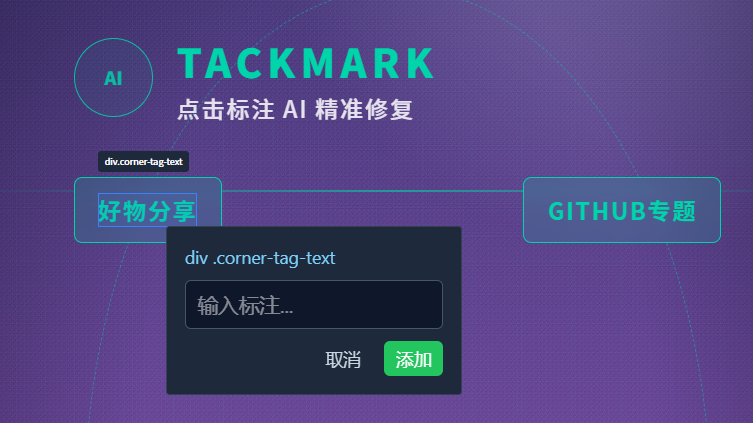

# TackMark

> **Click an element. Drop a note. Let AI fix the code.**
> Shorten the "screenshot → paste → describe → guess" feedback loop to "click → annotate → precise fix".

TackMark is a visual annotation plugin for Hermes Desktop that redefines how you collaborate with AI on UI. It brings Trae Work-style interactive preview into your agent workflow: load a page → click an element → leave a note → the AI receives an exact CSS selector plus element info, and gets it right the first time. No guessing.

**What used to take 3 rounds of screenshots and descriptions, now takes one click.**

---

## ✨ Features

| Capability | Description |
|------------|-------------|
| 🖥️ **Interactive Preview** | Loads local pages in an iframe with CORS support — WYSIWYG |
| 🎯 **Element-Level Annotation** | Click to annotate, with precise CSS selectors generated automatically (`div.hex` instead of "that blue icon") |
| 🧲 **Smart Popover** | The annotation box follows your mouse, auto-flips at screen edges, never leaves the viewport |
| ⚡ **One-Click Delivery** | Annotations flow into the session as structured Markdown — coordinates, selector, and note, zero ambiguity |
| 💾 **URL Memory** | Remembers your last previewed page — survives plugin reloads and app restarts |
| 🛡️ **Self-Healing** | Falls back to a help page when loading fails, clears stale cache, never shows a blank error |
| 🔔 **Live Feedback** | Annotation count and send status visible at all times |

## 📸 Screenshot

Click an element — the plugin highlights it and shows the exact CSS selector in a floating tag (`div.corner-tag-text` instead of "that blue icon"):



---

**中文版:** [README.zh-CN.md](README.zh-CN.md)

## 📦 Installation

### Option 1: git clone (recommended)

```bash
git clone https://github.com/freehul/tackmark.git
```

Then copy the plugin into Hermes' desktop plugins directory:

```bash
# Windows
mkdir %LOCALAPPDATA%\hermes\desktop-plugins\tackmark
copy /Y src\plugin.js %LOCALAPPDATA%\hermes\desktop-plugins\tackmark\plugin.js

# macOS / Linux
mkdir -p ~/.hermes/desktop-plugins/tackmark
cp src/plugin.js ~/.hermes/desktop-plugins/tackmark/plugin.js
```

> Plugin directory layout: `desktop-plugins/tackmark/plugin.js` (folder name must match the plugin id)

### Option 2: Manual download

1. Download [plugin.js](https://raw.githubusercontent.com/freehul/tackmark/main/src/plugin.js)
2. Place it at `desktop-plugins/tackmark/plugin.js` (create the folder if needed)

### Load the plugin

1. Open Hermes Desktop
2. The plugin hot-reloads automatically on save — if it doesn't appear, press `Ctrl+K` → select **"Reload desktop plugins"**
3. The **TackMark** tab appears in the right panel

### Dependencies

- Hermes Desktop (with desktop plugin support)
- Python 3 (optional — only needed for the local `serve.py` server)

### Auto-start with Hermes (recommended)

The #1 new-user pitfall: forget to start `serve.py` → white screen / chrome-error in the plugin. Fix it once:

Add this line to your Hermes launch script **before** the `hermes` command:

```bash
# Start TackMark's local server in background (required for the plugin to load pages)
start "TackMark Server" /MIN python serve.py <your-project-dir> 8080
```

On Windows with `launch-hermes.bat`, it goes just before the `start "" "%HERMES_EXE%"` line. After this, the server starts automatically every time you launch Hermes — zero friction.

> ⚠️ **Without this step**, the plugin will show a blank error page because nothing is listening on port 8080. Don't skip it.

---

## 🚀 Quick Start

### 1. Start the local server

If you followed the auto-start setup above, the server is already running. Otherwise:

```bash
python serve.py <your-project-dir> 8080
```

> `serve.py` ships with built-in CORS support — required by the plugin's page loader. A bare `python -m http.server` won't work.

### 2. Open the TackMark panel

Hermes Desktop → the plugin hot-reloads on save; if it doesn't appear, `Ctrl+K` → "Reload desktop plugins" → the **TackMark** tab appears in the right panel.

### 3. Load your page

Enter `http://localhost:8080/your-page.html` in the URL box → press Enter or hit **Refresh**.

### 4. Annotate → Send → AI fixes

```
① Click [📌 Annotate]     → Enter annotate mode (button turns green "🎯 Annotating")
② Hover an element        → Blue highlight + live selector tooltip
③ Click the target        → Annotation box pops up next to the cursor
④ Type your note → [Add]  → Annotation queued
⑤ Click [Send (N)]        → Structured feedback hits the session, AI fixes it
```

**What the AI receives:**

```
**Page Annotation Feedback:**

1. **div.hex**
   Replace with a different decoration
   Element: div .hex

Please update the code based on the annotation.
```

---

## 🖥️ UI Overview

```
┌─────────────────────────────────────────┐
│ [URL input]  [Refresh]  [📌Annotate]  [Send(2)]  [Clear] │
├─────────────────────────────────────────┤
│                                         │
│              Preview Area (iframe)      │
│       hover → highlight + selector      │
│       click → annotate                  │
│                                         │
├─────────────────────────────────────────┤
│        Open-Source Picks / Updates       │
└─────────────────────────────────────────┘
```

---

## 🧰 Technical Highlights

Not just cosmetics — a few solid engineering decisions:

- **Cross-Origin Annotation** — Browsers block `contentWindow.eval` on cross-origin iframes. TackMark solves this with **fetch + srcdoc injection**: srcdoc inherits the parent window's origin, so the annotation script runs normally, and `postMessage` handles cross-origin communication. Works on any local page.
- **Coordinate Double-Conversion** — iframe-local coordinates are precisely mapped to parent-window coordinates, so the popover always pins next to the element; **viewport clamping** (flips when it doesn't fit) keeps even bottom-right elements annotatable.
- **Fully Inline Styles** — no betting on which Tailwind classes exist; all UI uses inline styles, rendering identically in any environment.
- **Self-Healing State** — URL persistence plus failure fallback keeps plugin state always consistent.

---

## 🔧 Development & Contributing

```
tackmark/
├── src/plugin.js    # Main plugin file (installed to desktop-plugins/tackmark/)
├── serve.py         # CORS-enabled local server
├── DESIGN.md        # Design document
├── tackmark-help.html  # Default help page (served by serve.py)
└── tests/           # Tests
```

**Reload after editing:** `Ctrl+K` → "Reload desktop plugins"

Issues and PRs are welcome — let's make "click-to-fix" the standard.

---

## 📄 License

MIT — free to use, modify, and distribute.
